# MentorCheckEx

この拡張機能はテックアカデミーのメンターが課題レビューをチェックするために使うものです。  
その他の用途には使用できません。

## 機能

### 1️⃣ 課題レビュー関連

#### リロード機能
- 表示している課題レビューのページを定期的に読み込みます。  
その際、ページをリロードするのではなく、課題レビューの一覧だけリロードします。  
画像やスクリプトなどは読み込まないので、 **サーバーの負荷も軽い** はずです。
- 課題レビューの一覧が変化したら、チャイムとタイトルの点滅によってお知らせします。

#### Slackの新規課題レビュー到着監視機能
- **必ずSlackチャンネルに届くメッセージも確認してください。**
- Slackの課題レビューbotからの「課題を提出」という文字を監視し、到着したら通知を表示します。  
利用するためには、拡張機能を利用しているブラウザでSlackのワークスペースを開いてください。  
Slackの課題レビューチャンネルは開いておかなくても問題ないはずです。  
　  
課題レビューページ（ `/mentor/all/reports` ）を表示すると、サイドバーに「Slack通知用ページ」という項目があります。  
こちらを開いておくと、ここに新着課題レビューが表示されます。「開始」ボタンを押すと、課題の概要を飛ばして、すぐに課題レビューをスタートします。  
誰かが課題レビューを開始した場合は、一覧から削除されます。  
　  
通知の「課題レビュー開始」ボタンを押すと、自動的に課題レビューのページを開き、レビューを開始します。  
もし誰かが開始している場合は、課題レビューの画面が開かれるだけになります。  
　  
この昨日は設定でON／OFFすることが出来ます。  
また、「チャイム」のON／OFFを利用して、通知の音を出すか・出さないかを決定します。

#### 課題レビューを複数コースに対応させる
- ~~通常だと課題レビューはひとつのタブに付き一つのコースか、全てのコースかのどちらかですが、課題レビュー一覧のページに行って、拡張機能のアイコンをクリックすると、複数コースを選択することが出来ます。  
それに伴ってタイトルとドロップダウンがおかしくなるので、拡張機能側で修正しています。~~  
**システム側で実装されたので削除されました**  

#### 課題レビュー一覧調整機能
- 新規の課題レビューを待ち受けている場合に不必要な表示項目を減らしてシンプルに出来ます。
- 上記のシンプル化をしている場合、「詳細」ボタンを「開始」ボタンに変更し、レビューをすぐに開始できます。

#### 課題レビュー便利機能
- 課題レビューのページのサイドバーの受講生メモに飛ぶリンクを見やすくします。（下図）
- 課題レビューのページで「自動でCloud9を開く」ボタンを追加します。（下図）  
    `username` と `password` が合っている場合には自動で開きますが、違う場合ログイン画面以降に遷移しません。（代替 `username` と `password` の時など）  
    AWSのログイン画面のまま修正しログインできると、引き続きCloud9を自動で開きます。  
    同じ `window.name` を使いますので、1つのブラウザにつき1つのAWSしか開けません。  
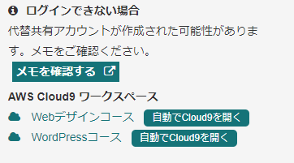

#### 課題レビュー中にコメント入力に飛べるページ内リンクを追加
- 課題レビュー中に直接コメントに飛ぶリンクを設置します。  
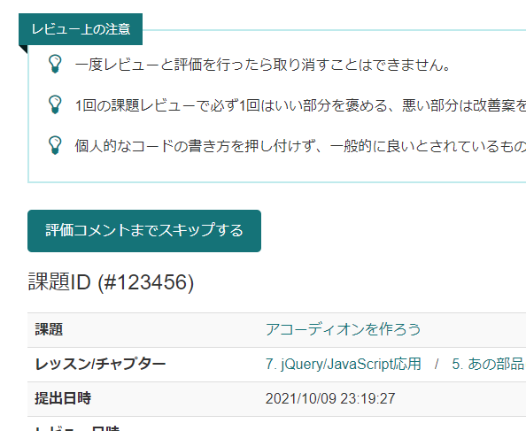

#### 閲覧カリキュラム表示機能
- 「はじめての副業」コースは複数カリキュラムが存在しているので、どのカリキュラムを見ているかを右上に表示します。

### 2️⃣ その他サポート系機能

#### 受講生画面便利機能
- 受講生画面で「自動でCloud9を開く」ボタンを追加します。
- メンタリング画面に「自動でCloud9を開く」ボタンを追加します。  
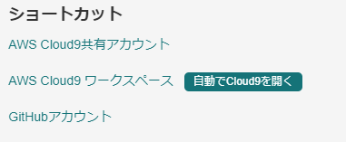

#### カリキュラムサブメニュー化機能
- サイドメニューの「カリキュラム」をサブメニュー化します。
- 設定でON/OFFが可能です。
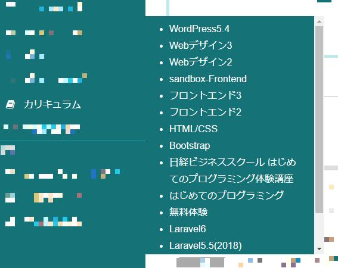

#### 課題レビュー基準表示・非表示機能
- 多コースを担当していると、あまり必要のない課題レビュー基準が表示されることがあります。  
それを設定でON／OFFすることが出来ます。

#### 受講生レッスン進捗絞り込み機能
- 多コースを受講している受講生のレッスンの進捗を見るのが辛い時があります。  
その時にコースを絞り込めます。
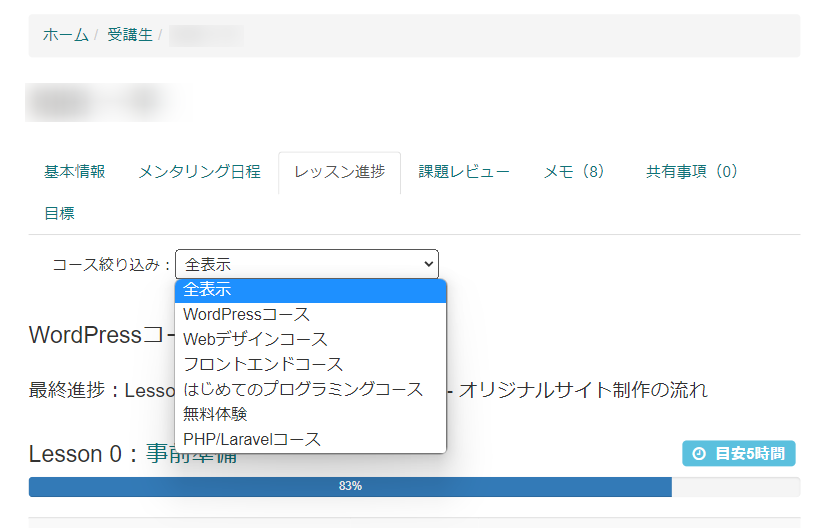

#### 課題レビューの時にメモをサイドバーに展開する機能
- 課題レビューの時にページ遷移せずに、メモをサイドバーに展開します。
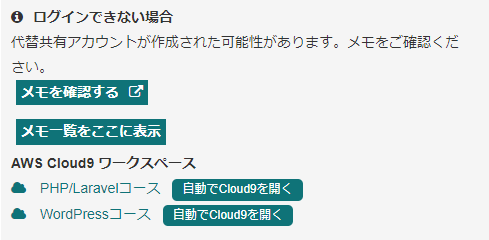

#### 課題レビューのGoogleドライブをダウンロードしVSCodeで開く機能
- GoogleドライブのリンクからFolder IDを取得し、コマンドを生成します。  
コマンド部分（下記のキャプチャでは `.\review.sh` の部分）はオプションで変更できます。Win or Macで変更してみてください。  
「はじ副」コースチャンネルにrcloneの設定方法、BATファイル・シェルスクリプトのサンプルが載っています。  
そちらをご覧ください。  
~~テキストボックスをクリックするだけで、コピーするはずです。~~  
ウィンドウがアクティブになるだけでコピーされてしまい、ウザいのでやめました。  
テキストボックスをクリックすると選択されるのでコピーしてください。  

#### ~~課題レビュー時の課題レビュー基準のコードをコピーするボタン~~
- TamperMonkeyのスクリプトに移行しました。

#### 課題レビューチェック機能
- 山本メンターの写経チェッカー的な機能を取り込みました。  
詳しくは [別ページ](ReviewChecker.md) に書きましたので、そちらをご覧ください。

#### フォント調査機能
- アイコンをクリックするとデベロッパーツールを使って、すべての要素のフォントを調査します。  
その結果ローカルフォントだと分かると色を付けますが、ローカルフォントを使っている部分の親要素まで色が付いてしまいます。  
ダイアログだけでも使っているかどうかは判別できます。  

#### その他課題レビュー用の機能
- Tampermonkeyのスクリプトで作っています。
- https://github.com/ShigeUe/tafs  
こちらをご覧ください。

### 3️⃣ メンター業務系機能

#### メンターのシフト確認機能（リーダー向け）
- メンターの他の人のシフトをコースごとに絞り込めるようにしました。
- 「他のメンターの予定」の中に、自分の予定を入れるようにしました。常に一番上に表示されます。
- シフトで絞った後に、前半・後半で追加絞り込みが出来ます。
- 前半・後半が見やすくなっています。  
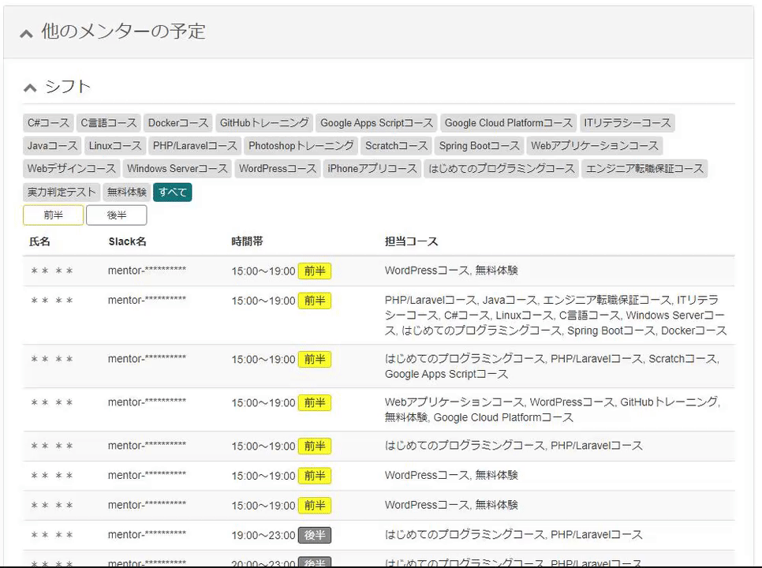

#### 確定メンタリングカレンダー表示機能
- 「スケジュール」→「確定メンタリング一覧」の画面に「カレンダー表示」というボタンを追加します。  
これを押すと、カレンダー表示に切り替わります。時間と名前しか出ていませんが、ホバーするとコース名を表示します。  
「確定メンタリング一覧」ボタンを押すと、元の画面に戻ります。  
カレンダー表示状態で、「＜」ボタンや「＞」ボタンで月を移動できます。

#### 確定メンタリング件数カウント機能
- 「スケジュール」→「確定メンタリング一覧」の画面に「月間集計」というボタンを追加します。  
これを押すとダイアログが開きます。コースごとのメンタリングの件数を集計します。  
×ボタンを押すか、Escキーでダイアログを閉じることが出来ます。  
右下のグリップを掴むと、ダイアログの縦方向の大きさを変えられます。

#### 確定シフト時間合計機能
- 「スケジュール」→「確定シフト一覧」の画面に合計時間を追加します。  
スケジュールの一番下に「合計時間」の欄が増えます。一時間未満は小数点の時間として表示するはずです。

### 4️⃣ その他機能
- バージョンアップお知らせ機能  
バージョンアップ時に通知で一度だけお知らせします。  
サイドバーにバージョンアップがあることを表示します。  
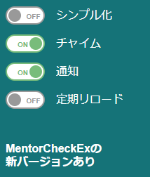  
バージョンアップについては、下の方に書いています。

## インストール方法
- この拡張機能はWebストアに公開していませんので、以下の手順でインストールしてください。
    1. GitHubの [リリースページ](https://github.com/ShigeUe/MentorCheckEx/releases)からダウンロードする。  
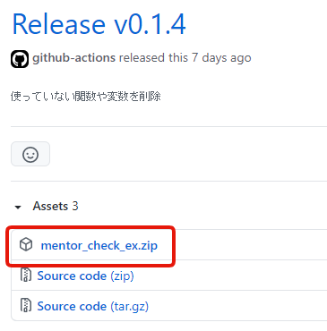
    1. 展開したら、 `mentor_check_ex` というフォルダを適当な場所に移動する。  
移動した先がプラグインのインストールフォルダになりますので、インストールしたら移動しないでください。
    1. Chromeのアドレスバーに `chrome://extensions/` を入れて、拡張機能一覧を表示する。
    1. 右上の「デベロッパー モード」をONにする。  
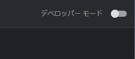
    1. 左上に「パッケージ化されていない拡張機能を読み込む」ボタンが現れるので、それを押す。
    1. 先ほどの `mentor_check_ex` フォルダを指定する。
以上でインストールできるはずです。

## 拡張機能の設定
- 拡張機能のオプションには以下の項目があります。
    - **リロード間隔**  
30秒～300秒（5分）で指定します。
    - **チャイム**  
チェックされていると、変更が合った時に「ピンポン」という音を鳴らします。
    - **通知**  
チェックされているとデスクトップ通知とタイトルのフラッシュを行います。  
（デスクトップ通知は隣のリンクでテストできます）
    - **シンプル化時に課題レビューをすぐに開始する**  
後ほど解説しますが、シンプル化している時に、一覧のボタンを変化させ、「詳細」ボタンを「開始」ボタンにします。  
これをクリックすると、課題の詳細を省いてすぐにレビューを開始します。
    - **カリキュラムのサブメニューを表示する**  
チェックされていると、サイドバーの「カリキュラム」をクリックするとサブメニューを表示し、一発で該当のカリキュラムを表示します。
    - **カリキュラムのサブメニューの表示・非表示**  
チェックボックスをON/OFFすることで、サブメニューに表示するカリキュラムを選択することが出来ます。
    - **課題レビュー基準の表示・非表示**  
チェックボックスをON/OFFすることで、課題レビュー基準の一覧から隠すことが出来ます。
    - **AWSのログイン情報**  
直接「ユーザー名」と「パスワード」を指定してもいいですし、一度でもユーザーページや課題レビューページに入ると自動的に設定に保存されます。
    - **設定全削除ボタン**  
設定をすべて削除します。表示がおかしくなったりした場合、設定を一度削除してみてください。

GitHubのバージョン情報を取得して、ローカルのバージョン情報と比較して新しくなっていたら、メッセージが表示されます。

## 設定の反映

- 設定は対象のページをリロードしないと反映されません。ご注意ください。

## ページ内の設定

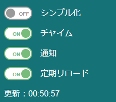

ページ内に一時的な設定が表示されます。

### シンプル化

- 表示を課題レビューを始めるために必要な情報だけに絞ります。  
また、拡張機能の設定で「シンプル化時に課題レビューをすぐに開始する」をONにしていると、一覧のボタンを変化させ、「詳細」ボタンを「開始」ボタンにします。

### チャイム

- 拡張機能の設定をこのページ内だけ変更します。

### 通知

- 拡張機能の設定をこのページ内だけ変更します。

### 定期リロード

- 拡張機能の設定内のリロード間隔ごとにページ内を書き換えます。  
更新時間が下に表示されます。

## バージョンアップ

- プラグインから更新の通知が来たり、画面に更新のお知らせが出ている場合は、インストールの手順と同じようにダウンロードし、インストールしたフォルダに上書きしてください。  
- 設定はファイルに保存されていませんので、上書きして大丈夫です。
- その後、プラグインのアイコンを右クリックして「拡張機能を管理」をクリックします。
- 「デベロッパーモード」がONにして、更新ボタンを押してください。  
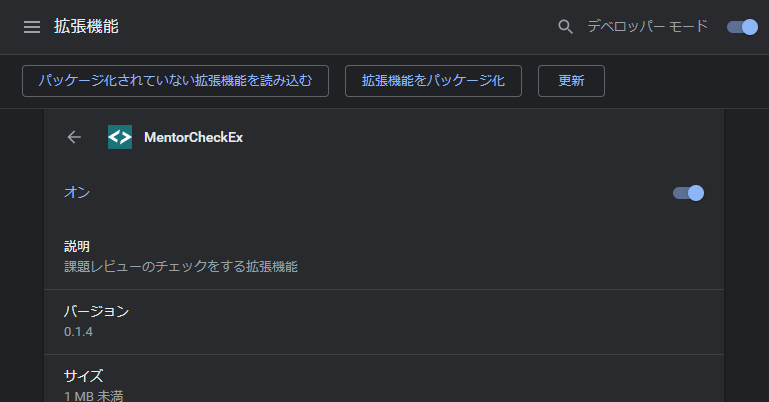

## 免責事項・注意事項など
- このプラグインを利用したいかなる損害に対して、当方は一切責任を負いません。  
ご自身の責任においてご利用ください。
- このプラグインとテックアカデミー及びキラメックスは何の係わりもありません。
- 取得した情報はプラグインの動作以外には利用していません。ソースコードはGitHubで公開していますので、不審点がありましたらそちらで調査してみてください。
- ご意見・ご要望はメンター用slackでお受けします。それらしい人を探してみてください。  
（これを利用している人は誰が作者なのか分かっているはずですが）

## 変更履歴
- `0.6.1` 課題レビューDIFF機能に課題のタイトル・注意文追加
- `0.6.0` 課題レビューDIFF機能のON/OFFオプション追加
- `0.5.9` 課題レビューDIFF機能 から 課題レビューチェック機能に変更
- `0.5.8` フォント調査機能の要素特定方法を修正
- `0.5.7` フォント調査機能を追加
- `0.5.6` 雑多の機能はTamperMonkeyのスクリプトに移動
- `0.5.5` 課題レビューDIFF機能修正
- `0.5.4` 課題レビューDIFF機能。slackのメッセージ入力中表示機能（おまけ）
- `0.5.3` 閲覧カリキュラム表示機能追加
- `0.5.2` 別カリキュラムを追加
- `0.5.1` 課題レビュー時の解答コードをコピーできるボタンを設置（Tampermonkeyに移動）
- `0.5.0` 課題レビューのGoogleドライブをダウンロードしVSCodeで開く機能を修正
- `0.4.9` 課題レビューのGoogleドライブをダウンロードしVSCodeで開く機能を追加
- `0.4.8` 午前シフトに対応
- `0.4.7` slackの仕様変更に対応
- `0.4.6` ダークモード機能のバグ修正
- `0.4.5` カリキュラム画面のみダークモード機能を実装
- `0.4.4` 課題レビューのレイアウトが変わったので、メモ確認をページ上部に変更
- `0.4.3` 課題レビューの時にメモをサイドバーに展開する機能のバグ修正
- `0.4.2` 課題レビューの時にメモをサイドバーに展開する機能追加
- `0.4.1` Slackからプラグインへのメッセージ転送を最小化。課題を開くだけのボタンを設置
- `0.4.0` 受講生レッスン進捗絞り込み機能追加
- `0.3.9` AWSのサインインドメインが追加されていたので、自動でCloud9を開くボタンが動作しなかったのを修正
- `0.3.8` 課題レビューを見ると課題レビュー基準のオプションを初期化してしまうバグ修正
- `0.3.7` 課題レビューとメンタリングのタブが消えるバグを修正
- `0.3.6` 課題レビューの仕様変更に伴う機能の削除。及びオプション表示時のコースの取得方法変更
- `0.3.5` 課題レビューメッセージの変更に伴う修正
- `0.3.4` スケジュールページのレイアウト変更に伴う修正
- `0.3.3` 課題レビューページのレイアウト変更に伴う修正
- `0.3.2` 確定メンタリングカレンダー表示機能追加
- `0.3.1` #12 のバグフィックス
- `0.3.0` スケジュールの中の他のメンターの予定に自分が入るように修正
- `0.2.9` Slackの新規課題レビュー到着監視機能を安定化。 `manifest.json` 整理整頓
- `0.2.8` 課題レビュー中にコメント入力に飛べるページ内リンクを追加
- `0.2.7` バグFix
- `0.2.6` Slackの新規課題レビュー到着監視機能（ベータ版）修正
- `0.2.5` Slackの新規課題レビュー到着監視機能（ベータ版）追加
- `0.2.4` 課題レビュー基準表示・非表示機能追加
- `0.2.3` カリキュラムサブメニューの項目の表示・非表示機能バグフィックス
- `0.2.2` カリキュラムサブメニューの項目の表示・非表示機能追加
- `0.2.1` シフト時間・メンタリング件数合計機能追加
- `0.2.0` カリキュラムサブメニュー化機能追加のバグフィックス
- `0.1.9` カリキュラムサブメニュー化機能追加
- `0.1.8` オプション画面にバージョンを表示。ダークモードに対応
- `0.1.7` 複数ウィンドウの時に絞り込みが出来ないバグを修正
- `0.1.6` アイコンをクリックしたときに、課題レビューをするコースを複数選択出来るように変更
- `0.1.5` シンプル化の時にコース名を消さないように変更
- `0.1.4` 使っていない関数や変数を削除
- `0.1.3` AWSのログイン情報を設定に保存するように修正
- `0.1.2` 表記修正
- `0.1.1` デスクトップ通知を追加
- `0.1.0` リロード時間を最低30秒に変更など
- `0.0.9` メンターシフト絞り込みにAM・PM追加。バージョンアップお知らせ機能変更。
- `0.0.8` リロード機能バグフィックス
- `0.0.7` バージョンチェック機能バグフィックス
- `0.0.6` バージョンチェックお知らせ機能追加
- `0.0.5` ユーザーページの「自動でCloud9を開く」ボタンを設置
- `0.0.4` 小さい不具合修正
- `0.0.3` メンターのシフト確認機能
- `0.0.2` バージョン確認機能追加
- `0.0.1` 公開
