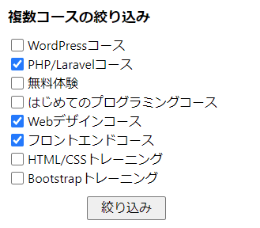
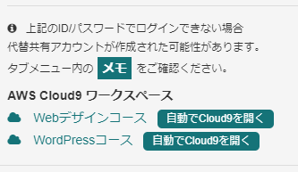

# MentorCheckEx

この拡張機能はテックアカデミーのメンターが課題レビューをチェックするために使うものです。  
その他の用途には使用できません。

## 機能

### リロード機能
- 表示している課題レビューのページを定期的に読み込みます。  
その際、ページをリロードするのではなく、課題レビューの一覧だけリロードします。  
画像やスクリプトなどは読み込まないので、 **サーバーの負荷も軽い** はずです。
- 課題レビューの一覧が変化したら、チャイムとタイトルの点滅によってお知らせします。

### 課題レビューを複数コースに対応させる
- 通常だと課題レビューはひとつのタブに付き一つのコースか、全てのコースかのどちらかですが、課題レビュー一覧のページに行って、拡張機能のアイコンをクリックすると、複数コースを選択することが出来ます。  
それに伴ってタイトルとドロップダウンがおかしくなるので、拡張機能側で修正しています。  
**（メンター機能の裏技っぽいので、いつか廃止されるかもしれません。ご注意ください）**  

### 課題レビュー一覧調整機能
- 新規の課題レビューを待ち受けている場合に不必要な表示項目を減らしてシンプルに出来ます。
- 上記のシンプル化をしている場合、「詳細」ボタンを「開始」ボタンに変更し、レビューをすぐに開始できます。

### 課題レビュー便利機能
- 課題レビューのページのサイドバーの受講生メモに飛ぶリンクを見やすくします。（下図）
- 課題レビューのページで「自動でCloud9を開く」ボタンを追加します。（下図）  
    `username` と `password` が合っている場合には自動で開きますが、違う場合ログイン画面以降に遷移しません。（代替 `username` と `password` の時など）  
    AWSのログイン画面のまま修正しログインできると、引き続きCloud9を自動で開きます。  
    同じ `window.name` を使いますので、1つのブラウザにつき1つのAWSしか開けません。  

### 受講生画面便利機能
- 受講生画面で「自動でCloud9を開く」ボタンを追加します。（上図に同じ）
- メンタリング画面に「自動でCloud9を開く」ボタンを追加します。  

### カリキュラムサブメニュー化機能
- サイドメニューの「カリキュラム」をサブメニュー化します。  

- 設定でON/OFFが可能です。

### メンターのシフト確認機能（リーダー向け）
- メンターの他の人のシフトをコースごとに絞り込めるようにしました。
- シフトで絞った後に、前半・後半で追加絞り込みが出来ます。
- 前半・後半が見やすくなっています。  

### その他機能
- バージョンアップお知らせ機能  
バージョンアップ時に通知で一度だけお知らせします。  
サイドバーにバージョンアップがあることを表示します。  
  
バージョンアップについては、下の方に書いています。

## インストール方法
- この拡張機能はWebストアに公開していませんので、以下の手順でインストールしてください。
    1. GitHubの [リリースページ](https://github.com/ShigeUe/MentorCheckEx/releases)からダウンロードする。  

    1. 展開したら、 `mentor_check_ex` というフォルダを適当な場所に移動する。  
移動した先がプラグインのインストールフォルダになりますので、インストールしたら移動しないでください。
    1. Chromeのアドレスバーに `chrome://extensions/` を入れて、拡張機能一覧を表示する。
    1. 右上の「デベロッパー モード」をONにする。  

    1. 左上に「パッケージ化されていない拡張機能を読み込む」ボタンが現れるので、それを押す。
    1. 先ほどの `mentor_check_ex` フォルダを指定する。
以上でインストールできるはずです。

## 拡張機能の設定
- 拡張機能のオプションには以下の項目があります。
    - **リロード間隔**  
30秒～300秒（5分）で指定します。
    - **チャイム**  
チェックされていると、変更が合った時に「ピンポン」という音を鳴らします。
    - **通知**  
チェックされているとデスクトップ通知とタイトルのフラッシュを行います。  
（デスクトップ通知は隣のリンクでテストできます）
    - **シンプル化時に課題レビューをすぐに開始する**  
後ほど解説しますが、シンプル化している時に、一覧のボタンを変化させ、「詳細」ボタンを「開始」ボタンにします。  
これをクリックすると、課題の詳細を省いてすぐにレビューを開始します。
    - **カリキュラムのサブメニューを表示する**  
チェックされていると、サイドバーの「カリキュラム」をクリックするとサブメニューを表示し、一発で該当のカリキュラムを表示します。
    - **AWSのログイン情報**  
直接「ユーザー名」と「パスワード」を指定してもいいですし、一度でもユーザーページや課題レビューページに入ると自動的に設定に保存されます。

GitHubのバージョン情報を取得して、ローカルのバージョン情報と比較して新しくなっていたら、メッセージが表示されます。

## 設定の反映

- 設定は対象のページをリロードしないと反映されません。ご注意ください。

## ページ内の設定

ページ内に一時的な設定が表示されます。

### シンプル化

- 表示を課題レビューを始めるために必要な情報だけに絞ります。  
また、拡張機能の設定で「シンプル化時に課題レビューをすぐに開始する」をONにしていると、一覧のボタンを変化させ、「詳細」ボタンを「開始」ボタンにします。

### チャイム

- 拡張機能の設定をこのページ内だけ変更します。

### 通知

- 拡張機能の設定をこのページ内だけ変更します。

### 定期リロード

- 拡張機能の設定内のリロード間隔ごとにページ内を書き換えます。  
更新時間が下に表示されます。

## バージョンアップ

- プラグインから更新の通知が来たり、画面に更新のお知らせが出ている場合は、インストールの手順と同じようにダウンロードし、インストールしたフォルダに上書きしてください。  
- 設定はファイルに保存されていませんので、上書きして大丈夫です。
- その後、プラグインのアイコンを右クリックして「拡張機能を管理」をクリックします。
- 「デベロッパーモード」がONにして、更新ボタンを押してください。  

## 免責事項・注意事項など
- このプラグインを利用したいかなる損害に対して、当方は一切責任を負いません。  
ご自身の責任においてご利用ください。
- このプラグインとテックアカデミー及びキラメックスは何の係わりもありません。
- 取得した情報はプラグインの動作以外には利用していません。ソースコードはGitHubで公開していますので、不審点がありましたらそちらで調査してみてください。
- ご意見・ご要望はメンター用slackでお受けします。それらしい人を探してみてください。  
（これを利用している人は誰が作者なのか分かっているはずですが）

## 変更履歴
- `0.1.9` カリキュラムサブメニュー化機能追加
- `0.1.8` オプション画面にバージョンを表示。ダークモードに対応
- `0.1.7` 複数ウィンドウの時に絞り込みが出来ないバグを修正
- `0.1.6` アイコンをクリックしたときに、課題レビューをするコースを複数選択出来るように変更
- `0.1.5` シンプル化の時にコース名を消さないように変更
- `0.1.4` 使っていない関数や変数を削除
- `0.1.3` AWSのログイン情報を設定に保存するように修正
- `0.1.2` 表記修正
- `0.1.1` デスクトップ通知を追加
- `0.1.0` リロード時間を最低30秒に変更など
- `0.0.9` メンターシフト絞り込みにAM・PM追加。バージョンアップお知らせ機能変更。
- `0.0.8` リロード機能バグフィックス
- `0.0.7` バージョンチェック機能バグフィックス
- `0.0.6` バージョンチェックお知らせ機能追加
- `0.0.5` ユーザーページの「自動でCloud9を開く」ボタンを設置
- `0.0.4` 小さい不具合修正
- `0.0.3` メンターのシフト確認機能
- `0.0.2` バージョン確認機能追加
- `0.0.1` 公開
