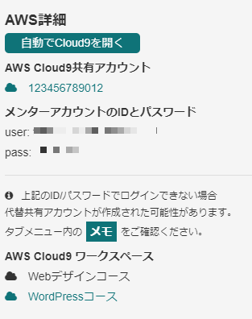
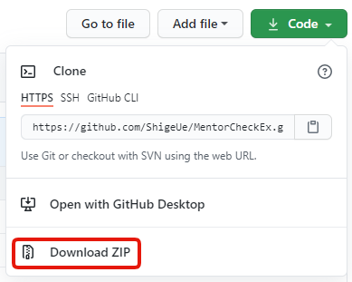
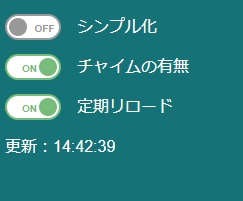

# MentorCheckEx

この拡張機能はテックアカデミーのメンターが課題レビューをチェックするために使うものです。  
その他の用途には使用できません。

## 機能

- 表示している課題レビューのページを定期的に読み込みます。  
その際、ページをリロードするのではなく、課題レビューの一覧だけリロードします。  
画像やスクリプトなどは読み込まないので、サーバーの負荷も軽いはずです。
- 課題レビューの一覧が変化したら、チャイムとタイトルの点滅によってお知らせします。
- 新規の課題レビューを待ち受けている場合に不必要な表示項目を減らしてシンプルに出来ます。
- 上記のシンプル化をしている場合、「詳細」ボタンを「開始」ボタンに変更し、レビューをすぐに開始できます。
- 課題レビューのページのサイドバーの受講生メモに飛ぶリンクを見やすくします。（下図）
- 課題レビューのページでレビューしようとしているCloud9以外のリンクを無効化します。（下図）
- 課題レビューのページで自動でCloud9を開きます。（下図）  
usernameとpasswordが合っている場合には開きますが、そうでないと失敗します。  
（代替usernameとpasswordの時など）  
_  

## インストール方法

この拡張機能はWebストアに公開していませんので、以下の手順でインストールしてください。

1. GitHubからダウンロードする。  

1. 展開したら、 `mentor_check_ex` というフォルダを適当な場所に移動する。  
移動した先がプラグインのインストールフォルダになりますので、インストールしたら移動しないでください。  
（フォルダの中にもう一つ同じ名前のフォルダがある場合は、それを移動してください）
1. Chromeのアドレスバーに `chrome://extensions/` を入れて、拡張機能一覧を表示する。
1. 右上の「デベロッパー モード」をONにする。  

1. 左上に「パッケージ化されていない拡張機能を読み込む」ボタンが現れるので、それを押す。
1. 先ほどの `mentor_check_ex` フォルダを指定する。
以上でインストールできるはずです。

## 拡張機能の設定

拡張機能のオプションには以下の項目があります。

- **リロード間隔**  
15秒～300秒（5分）で指定します。
- **チャイム有無**  
チェックされていると、変更が合った時に「ピンポン」という音を鳴らします。  
（課題が減っても鳴ってしまいます）
- **シンプル化時に課題レビューをすぐに開始する**  
後ほど解説しますが、シンプル化している時に、一覧のボタンを変化させ、「詳細」ボタンを「開始」ボタンにします。  
これをクリックすると、課題の詳細を省いてすぐにレビューを開始します。

## 設定の反映

設定は対象のページをリロードしないと反映されません。ご注意ください。

## ページ内の設定

ページ内に一時的な設定が表示されます。

- **シンプル化**  
表示を課題レビューを始めるために必要な情報だけに絞ります。  
また、拡張機能の設定で「シンプル化時に課題レビューをすぐに開始する」をONにしていると、一覧のボタンを変化させ、「詳細」ボタンを「開始」ボタンにします。
- **チャイムの有無**  
拡張機能の設定を、このページ内だけ変更します。
- **定期リロード**  
拡張機能の設定内のリロード間隔ごとにページ内を書き換えます。  
更新時間が下に表示されます。
